<h1 align="center">
  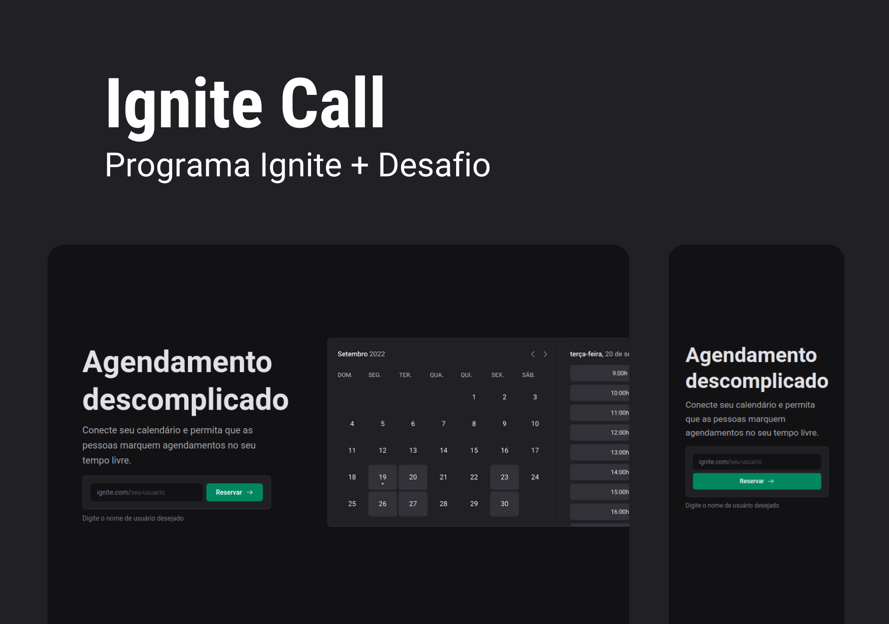
</h1>

## 💻 Sobre o projeto

<p>É uma aplicação que utiliza a API do Google Agenda para fazer agendamentos entre usuários e criar automaticamente uma notificação para os usuário no Google Agenda assim como um link para uma sala no Google Meet.</p>
<p>O projeto foi desenvolvido durante a trilha de ReactJS do Ignite na plataforma de estudos da Rocketseat.</p>
<p>A responsividade foi adicionada como extra.</p>

---

## ⚙️ Funcionalidades

- Login com o Google.
- Cadastrar dias da semana e horários disponíveis.
- Realizar agendamentos por meio de um calendário.
- Criar um agendamento no Google Agenda com uma sala no Google Meet.

Para o desenvolvimento foram aplicados conceitos como:
- Rotas
- Design System
- Conexão com APIs externas
- Tipagem
- Autenticação
- Validação de dados
- Cookies
- Deploy de aplicações com Next.js

---

## 🎨 Layout

### Web (Desktop)

<p align="center" style="display: flex; align-items: flex-start; justify-content: center;">
  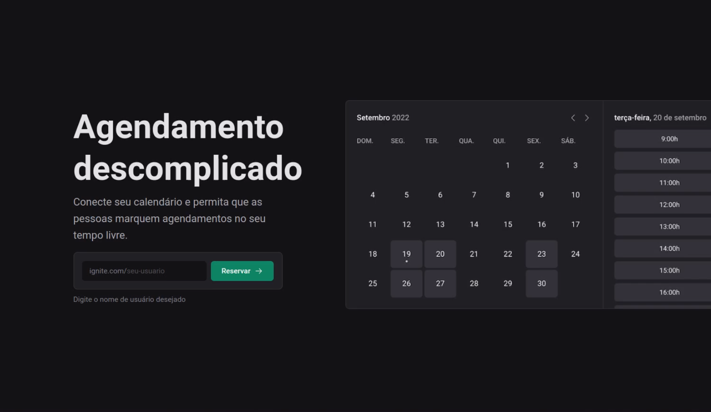

  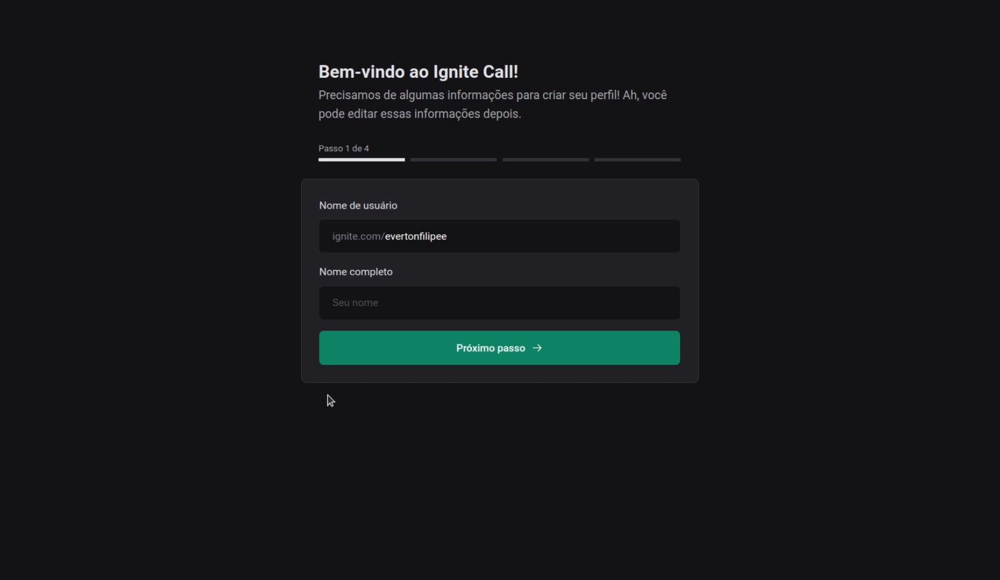

  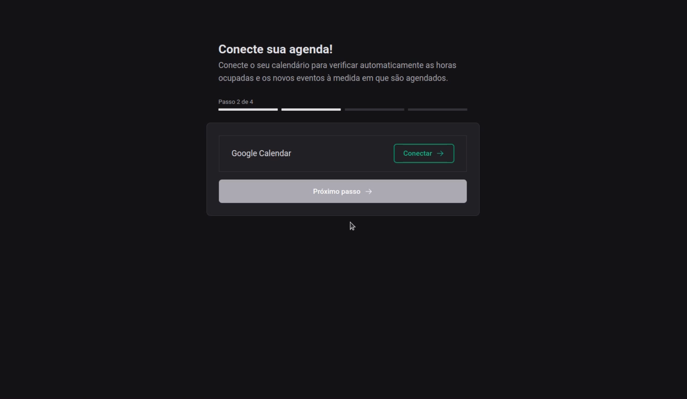

  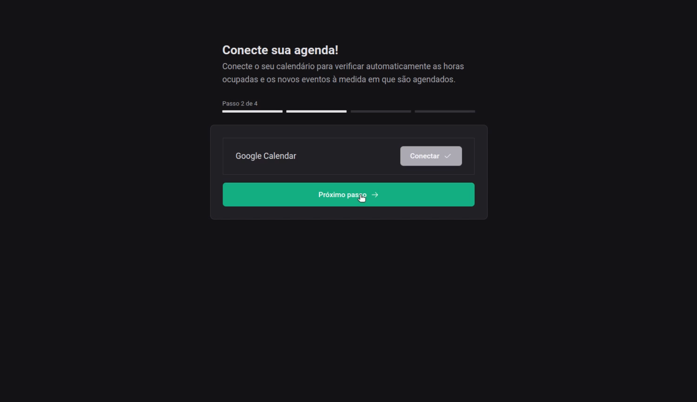

  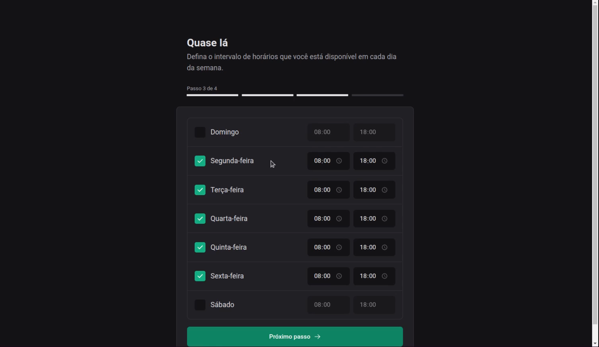

  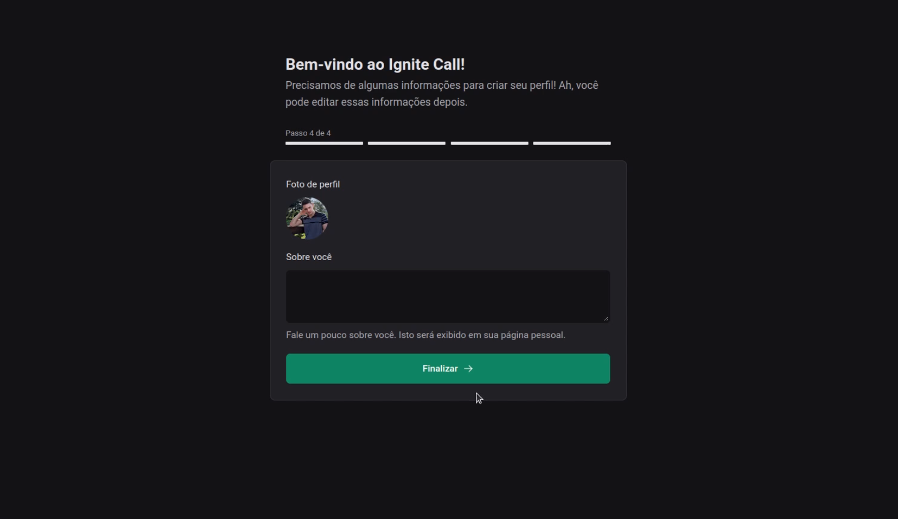

  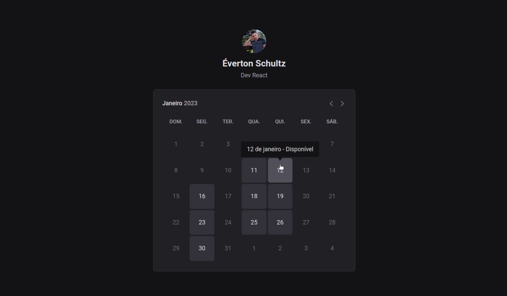

  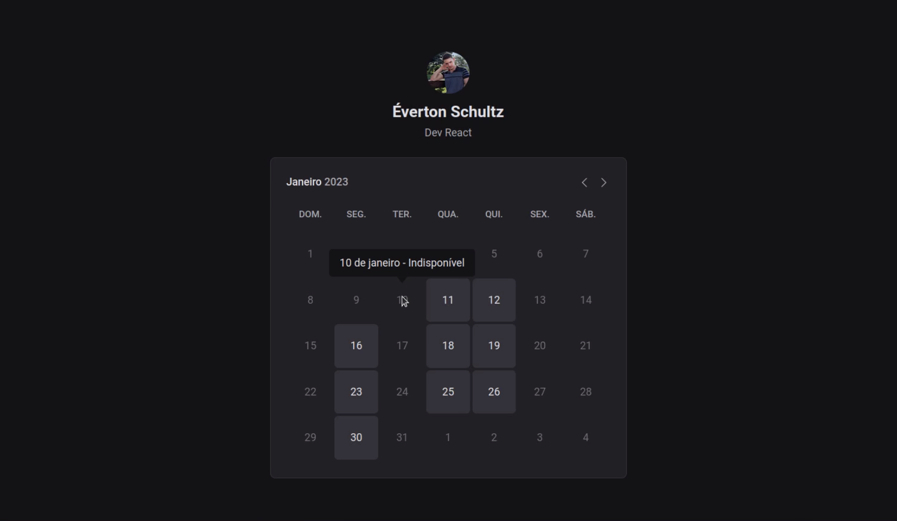

  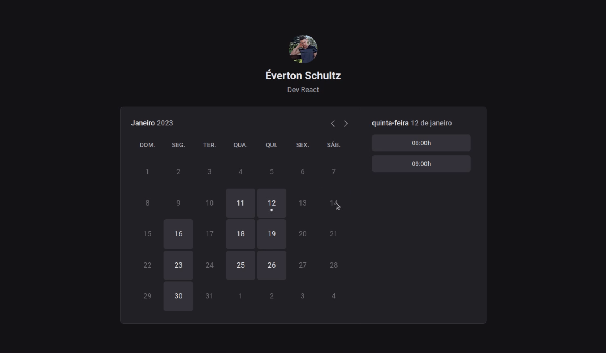

  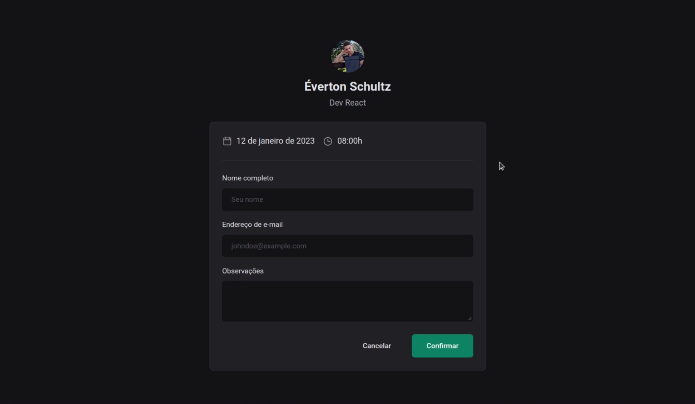

  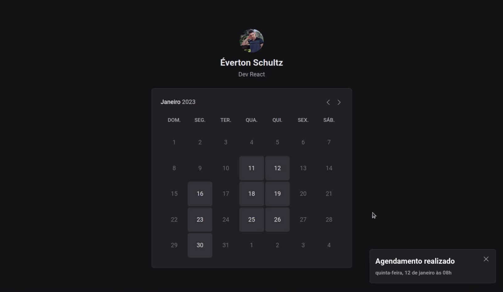

  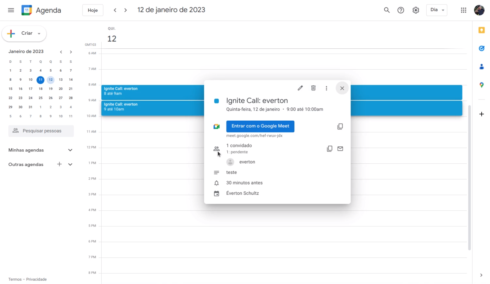
</p>

---

## 🚀 Como executar o projeto
A aplicação foi desenvolvida utilizando [Next.js](https://nextjs.org/docs/getting-started)

### Pré-requisitos
Antes de começar, você vai precisar ter instalado em sua máquina o [Git](https://git-scm.com). Além disso, é bom ter um editor para trabalhar com o código como [VSCode](https://code.visualstudio.com/). Também considere utilizar a documentação do [Next.js](https://nextjs.org/docs/getting-started) para fazer alterações no projeto.

#### Rodando a aplicação web (Frontend)
```bash

# Clone este repositório
$ git clone git@github.com:evertonschultz/06-ignite-call.git

# Acesse a pasta do projeto no seu terminal/cmd
$ cd 06-ignite-call

# Instale as dependências
$ npm install

# Antes de rodar a aplicação você deve criar um arquivo .env seguindo o exemplo do arquivo example.env.local e adicionar valores válidos as variáveis ambiente.

# Execute a aplicação em modo de desenvolvimento
$ npm run dev

# A aplicação será aberta na porta:3000 - acesse http://localhost:3000

```

---

## 🛠 Tecnologias
As principais ferramentas que foram usadas na construção do projeto:

#### **Website**  [Next.js](https://nextjs.org/docs/getting-started)

-   **[Next Auth](https://next-auth.js.org/)**
-   **[React Hook Form](https://react-hook-form.com/)**
-   **[Prisma](https://www.prisma.io/)**
-   **[Radix-ui - React Toast](https://www.radix-ui.com/docs/primitives/components/toast)**
-   **[Radix-ui - React Tooltip](https://www.radix-ui.com/docs/primitives/components/tooltip)**
-   **[Tanstack](https://tanstack.com/query/latest)**
-   **[Dayjs](https://www.npmjs.com/package/dayjs)**
-   **[Eslint](https://eslint.org/)**
-   **[Nookies](https://www.npmjs.com/package/nookies)**
-   **[Zod](https://www.npmjs.com/package/zod)**

---

## 🦸 Autor

 <br />
 <sub><b>Everton Schultz</b></sub></a>
 <br />

[](https://www.linkedin.com/in/https://www.linkedin.com/in/%C3%A9verton-schultz-824a1612b/)
[](mailto:evertonf.m.schultz98@gmail.com)

## License
Este projeto pode ser usado por qualquer pessoa! Licença MIT
